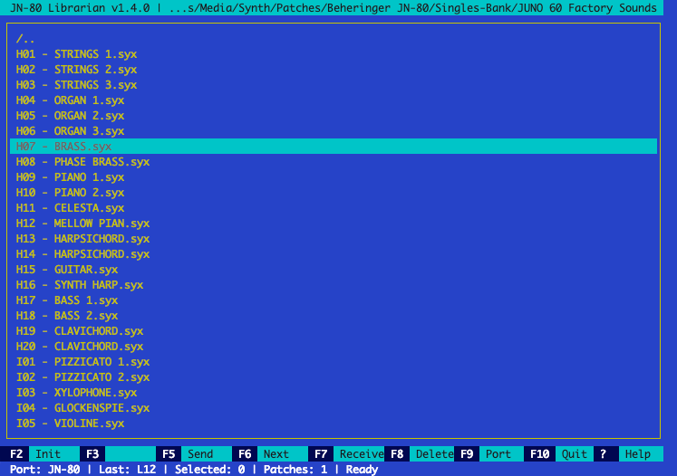

# JN-80 Librarian

Terminal SysEx librarian for Behringer JN-80 using a full-screen curses TUI.



## Features

- Browse folders and `.syx` files in a full-screen TUI
- Copy/send `.syx` files to an explicit destination or the next sequential slot
- Merge and split `.syx` files
- Erase synth presets by bank/slot range
- Receive presets from the synth for backup and organization
- Delete `.syx` files from the current folder
- Keep source files unchanged by rewriting JN-80 DATA bank/slot bytes in memory during send
- Persist MIDI port, last written position, last F5 target, and last browsed directory

## Prerequisites

- Python 3 installed locally (`python3 --version`)
- If Python 3 is not installed, download it from: https://www.python.org/downloads/

## Local setup (venv only)

```bash
python3 -m venv .venv
.venv/bin/pip install -r requirements.txt
```

## Run

```bash
.venv/bin/python -m jn80_librarian
```

## Controls

- `Arrow Up/Down`: Move cursor
- `PgUp/PgDn`: Move cursor by one page
- `Enter`: Open directory
- `Ctrl-T`: Toggle selection on highlighted `.syx` file and move cursor down
- `F2`: INIT erase presets in an inclusive bank/slot range (with confirmation)
- `F3`: Context action
  - `MERGE` when more than one file is selected: merge all selected `.syx` into a new output file
  - `SPLIT` when highlighted `.syx` has more than one preset:
    - save all presets as separate files, or
    - select presets from a patch list and save selected presets as separate files, or
    - open a patch list selector and save selected presets as one new `.syx` file (in selected order)
- `F9` or `M`: Open MIDI output port menu
- `F5`: Send highlighted/selected with bank+slot dialog
- `F6`: Send highlighted/selected to next slot after last write
- `F7` or `R`: Receive SysEx from synth and save as `.syx` in current folder
- `F8`: Delete selected/highlighted `.syx` file(s) (with confirmation)
- `?`: Show key help modal
- `F10` or `Q`: Quit

## AI Assistance

This project was developed with AI assistance (GitHub Copilot). All code has been reviewed, tested, and understood by the maintainer. The AI was used as a tool, not as a substitute for engineering judgment.

## License

This project is licensed under the MIT License. See the `LICENSE` file for details.

## Changelog

### 1.4.0 - 2026-05-31

- New features:
  - Added context-aware `F3` workflow with dynamic action label:
    - `MERGE` when multiple `.syx` files are selected,
    - `SPLIT` when highlighted file contains multiple presets,
  - Added `F3 MERGE` flow to combine selected `.syx` files into a new output file in selection order and frame order.
- Bug fixes:
  - Reset persisted digit focus when opening both F5 bank/slot and F2 INIT dialogs.

### 1.3.0 - 2026-05-31

- New features:
  - Added multi-frame `.syx` send support: `F5`/`F6` now sends all SysEx frames found in each selected file, in deterministic order.
  - Added active file patch-count indicator in the status bar (`Patches: N` / `Patches: invalid`).
  - Added app version display in the top title bar.
- Bug fixes:
  - Prevented `F6` from wrapping from `T20` to `A01`; copy-next now stops with an explicit error at end-of-memory.

### 1.2.0 - 2026-05-30

- New features:
  - Added `F8` delete flow for selected/highlighted `.syx` files with confirmation.
  - Added `PgUp`/`PgDn` navigation in the browser with page-sized movement.
  - Added live progress dialogs for send operations (`F5`/`F6`) and INIT erase (`F2`), with result shown in the same modal flow.
  - Added independent persisted `F5` target memory (last entered bank/slot).
- Bug fixes:
  - INIT no longer updates `Last` write history (reserved for successful file sends).

### 1.1.0 - 2026-05-30

- Added `F2` INIT workflow to erase presets in an inclusive bank/slot range with a confirmation prompt before write.
- Long paths in modal dialog content (port names, saved filenames) are now truncated from the left, keeping the filename tail visible.

### 1.0.0 - 2026-05-29

- Initial terminal-based JN-80 SysEx librarian release with a full-screen curses file browser for folders and `.syx` files.
- Multi-select workflow (`Ctrl-T`), persistent session state (MIDI port, last write position, last browsed directory), and keyboard-first navigation/help.
- MIDI send flows with `F5` (explicit bank/slot) and `F6` (auto-increment next slot), preserving selection order and clearing selections after successful sends.
- In-memory JN-80 destination rewrite before send (write-address + DATA bank/slot); source `.syx` files are never modified.
- Send feedback includes ACK/No ACK detection plus explicit result dialogs and status-bar updates.
- Receive flow with persistent modal UX (`F7`/`R`): filename entry, waiting/progress, any-key cancel, burst capture, and final stats.
- Receive parser supports single and multi-frame dumps, combines captured frames into one output file by default, and handles both binary and ASCII-hex SysEx inputs.
- Local venv-only setup and automated test coverage for app, MIDI transport, SysEx parsing/rewriting, positions, and config persistence.
